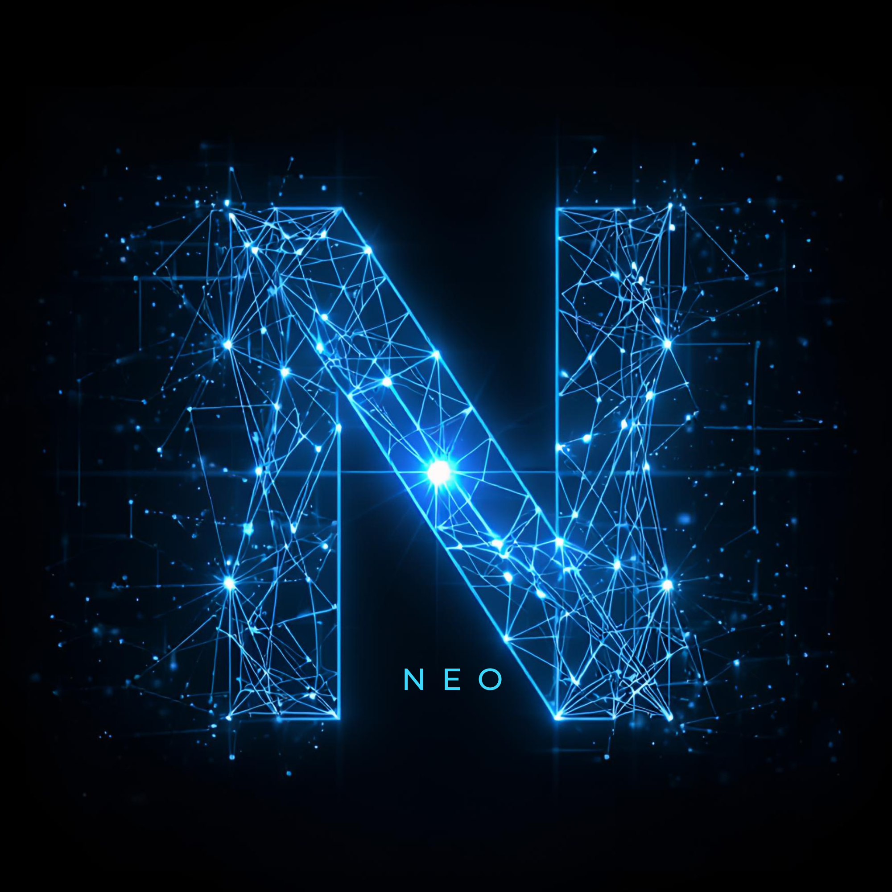

# 

**Neo** - Personal AI agent powered by the GitHub Copilot SDK, accessible via Telegram.

## Setup

### Prerequisites

- Node.js v24.14.0
- GitHub account with Copilot access
- Telegram Bot Token (from [@BotFather](https://t.me/BotFather))
- Telegram user ID (from [@userinfobot](https://t.me/userinfobot))
- Playwright Chromium browser (`npx playwright install --with-deps chromium`)

### Install

```bash
git clone https://github.com/saadjs/neo.git neo && cd neo
nvm use
npm install
cp .env.example .env
# Edit .env with tokens
```

### Run (dev)

```bash
npm run dev
```

### Telegram group chats

To respond to regular messages in group chats without being tagged, disable the bot's privacy mode in [@BotFather](https://t.me/BotFather):

```text
/setprivacy
→ select @your_bot
→ Disable
```

If the privacy mode was changed after the bot was already in the group, remove the bot and add it back so Telegram refreshes permissions. Otherwise Neo may still ignore normal group messages because Telegram never delivers them.

### Build & Run (production)

```bash
npm run build
node dist/index.js
```

### Deploy with Docker

```bash
cp .env.example .env
# Edit .env with secrets
docker compose up -d
docker compose logs -f  # view logs
```

### Deploy with systemd

Neo supports two Linux deployment modes:

- user service: runs under `~/.config/systemd/user` as the login user who installs it, similar to OpenClaw
- system service: runs under `/etc/systemd/system` as a dedicated `neo` user

Recommended first-time setup:

```bash
./deploy/setup-ubuntu.sh
```

The script prompts for `systemd scope (system/user)`:

- `user` is the default and installs a `systemd --user` unit at `~/.config/systemd/user`, defaults to `$HOME/neo`, and uses the current login user
- `system` keeps the existing production layout with `/opt/neo` and the `neo` user

For later updates, run the same command again from the server-side bootstrap checkout after pulling the latest commit:

```bash
git pull
./deploy/setup-ubuntu.sh
```

The script will prompt for the systemd scope, service name, install directory, and app user, then:

- install or update the pinned system Node runtime at `/usr/bin/node` when needed
- install the `systemd` unit
- clone or update the GitHub repo in the install directory
- optionally create and open `.env`
- run `npm ci` and `npm run build`
- install Playwright Ubuntu deps and Chromium
- run preflight checks
- optionally enable and start the service

Manual equivalent for a system service:

```bash
sudo ./deploy/install-systemd.sh

git clone --branch main git@github.com:saadjs/neo.git /opt/neo
cd /opt/neo

npm ci
npm run build
npx playwright install --with-deps chromium

# Create and edit /opt/neo/.env first
sudo chown -R neo:neo /opt/neo
sudo -u neo ./deploy/preflight.sh

sudo systemctl start neo
sudo journalctl -u neo -f  # view logs
```

Manual equivalent for a user service:

```bash
./deploy/install-systemd-user.sh neo "$HOME/neo" "$USER"

git clone --branch main git@github.com:saadjs/neo.git "$HOME/neo"
cd "$HOME/neo"

npm ci
npm run build
npx playwright install --with-deps chromium

# Create and edit $HOME/neo/.env first
./deploy/preflight.sh "$HOME/neo/.env"

sudo loginctl enable-linger "$USER"
systemctl --user start neo
journalctl --user -u neo -f  # view logs
```

After initial setup, the recommended update flow is a single command from the server-side Neo checkout:

```bash
./deploy/update.sh
```

What it does:

- requires a clean Git worktree
- fetches and fast-forwards the currently tracked branch
- runs `HUSKY=0 npm ci --include=dev`
- runs `npm run build`
- runs `./deploy/preflight.sh`
- restarts the configured `systemd` unit only if all prior steps succeed

Optional arguments:

```bash
./deploy/update.sh <service-name> <system|user>
```

Examples:

```bash
./deploy/update.sh neo system
./deploy/update.sh neo user
```

Health check only:

```bash
./deploy/doctor.sh
```

Notes:

- The setup script bootstraps system Node at `/usr/bin/node` and currently targets `v24.14.0`.
- Neo restarts by exiting and letting `systemd` restart the service via `Restart=always`.
- When run directly outside `systemd`, Neo defaults to `$HOME/.neo` for data and `$HOME/.neo/logs` for logs.
- The system service template sets `NEO_DATA_DIR=/opt/neo/data` and `NEO_LOG_DIR=/opt/neo/logs`.
- The user service template sets `NEO_DATA_DIR=$HOME/.neo` and `NEO_LOG_DIR=$HOME/.neo/logs`.
- The deploy setup now syncs code from the checkout's Git `origin` and current branch instead of copying files with `rsync`.
- User-service installs must run as the same login user that will own the `systemd --user` unit.
- User services run with the same filesystem permissions as the installing login user, so they can access files in that user's home directory such as shell dotfiles when needed.
- `systemd` does not automatically source `.bashrc` or `.zshrc`; put required runtime settings in Neo's `.env` unless explicitly loading shell startup files.
- `sudo loginctl enable-linger "$USER"` keeps a user service running after logout.
- `deploy/update.sh` sources `.env` first, so `NEO_SYSTEMD_UNIT` and `NEO_SYSTEMCTL_SCOPE` can define the default restart target.

## Commands

Send `/start` or `/help` in Telegram to see all available commands.

Key commands:

- `/new` — Start a fresh conversation
- `/model` — Switch models from a curated shortlist, with Show All for the full catalog
- `/cancel` — Stop the current task
- `/memory` — View or search memory
- `/reasoning` — Set reasoning effort level
- `/research` — Deep research on a topic (see [Research](#research) below)
- `/sessions` — List active sessions
- `/channel` — Configure group chat settings (label, topics, default model, reasoning effort)

## Tools

Neo registers these custom tools alongside the Copilot SDK's built-in capabilities (shell, filesystem, GitHub):

- **browser** — Automate websites with persistent Playwright sessions, screenshots, and stored credentials
- **memory** — Read/write/append/search memory files
- **reminder** — Create, list, and cancel scheduled reminders (once, daily, weekly, monthly, weekdays)
- **job** — Manage recurring AI jobs on cron schedules
- **conversation** — Search prior chats and retrieve recent history
- **research** — Deep research with parallel worker agents, web search, and structured report generation
- **system** — Inspect settings, apply safe config changes, restart

## Research

The `/research` command runs deep investigations using an orchestrator-worker pattern inspired by Anthropic's [multi-agent research system](https://www.anthropic.com/engineering/multi-agent-research-system):

```
/research <topic> [url1 url2 ...]
```

**Examples:**

- `/research quantum computing advances 2025`
- `/research rust vs go https://blog.rust-lang.org https://go.dev/blog`

**How it works:**

1. The orchestrator (your current `/model`) creates a research plan
2. Worker subagents (`task` tool) run in parallel, each researching a subtopic
3. Findings are synthesized, cross-referenced, and gaps filled
4. A comprehensive markdown report with citations is saved to `$NEO_DATA_DIR/research/`

**Depth levels:** quick (3-5 sources, 2 workers), standard (8-12 sources, 3-4 workers), deep (15+ sources, 5+ workers).

**Worker model:** Defaults to `copilot:claude-sonnet-4.6`, configurable via `RESEARCH_WORKER_MODEL` in `config.json`. Supports any `provider:model` format.

**Output destinations:** Local file (default), GitHub repo (`gh` CLI), or Google Docs (`gws` CLI).

## Memory

- `$NEO_DATA_DIR/SOUL.md` — Neo's persona (editable by Neo)
- `$NEO_DATA_DIR/PREFERENCES.md` — Learned user preferences
- `$NEO_DATA_DIR/HUMAN.md` — Facts about the user
- `$NEO_DATA_DIR/memory/MEMORY-yyyy-mm-dd.md` — Daily memory logs
- `$NEO_DATA_DIR/memory/MEMORY-SUMMARY-yyyy-Wnn.md` — Weekly memory summaries

Neo auto-compacts long conversations before they fall out of context. Session summaries are stored in the daily memory file and auto-tagged with topics. A weekly decay job (Sundays 3 AM UTC) compacts old daily entries into weekly summaries. All memory content is indexed for full-text search.

## Voice Messages

Send a voice message in Telegram and Neo will transcribe it via Deepgram and respond. Requires `DEEPGRAM_API_KEY` in `.env`.

## BYOK (Bring Your Own Key)

Neo supports multiple model providers alongside GitHub Copilot. Set API keys in `.env` to enable additional providers — their models appear in the `/model` picker with provider tags.

**Quick setup:**

```bash
# Add to .env — models from these providers appear automatically
ANTHROPIC_API_KEY=sk-ant-...    # Enables Claude models via Anthropic API
OPENAI_API_KEY=sk-...           # Enables GPT models via OpenAI API
AI_GATEWAY_API_KEY=vercel_...   # Enables Vercel AI Gateway models
```

**Usage:**

- `/model` — Opens your ordered shortlist first; use `Show All` to browse the full live catalog
- `/model anthropic:claude-opus-4-6` — Switch directly using `provider:model` syntax
- `/model vercel:anthropic/claude-sonnet-4.5` — Switch to a Vercel gateway model using its `provider/model` ID
- `/whichmodel` — Shows the active provider
- `/usage` — Shows Copilot plus any configured provider usage Neo can fetch

The shortlist is stored in Neo's managed `config.json`. The first entry is primary and later entries are fallback candidates. If a transient model-call failure exhausts retries, Neo will automatically switch to the next available fallback and replay the turn.

**Custom providers** (Ollama, other OpenAI-compatible endpoints):

```bash
NEO_PROVIDER_NAME=ollama
NEO_PROVIDER_TYPE=openai
NEO_PROVIDER_BASE_URL=http://localhost:11434/v1
```

Switching between providers triggers a session refresh (the SDK's `provider` config is session-level). Switching models within the same provider is instant.

## Environment Variables

See [`.env.example`](.env.example) for all options.

| Variable                       | Required | Description                                       |
| ------------------------------ | -------- | ------------------------------------------------- |
| `TELEGRAM_BOT_TOKEN`           | Yes      | From @BotFather                                   |
| `TELEGRAM_OWNER_ID`            | Yes      | Telegram user ID                                  |
| `GITHUB_TOKEN`                 | Yes      | GitHub PAT with Copilot access                    |
| `ANTHROPIC_API_KEY`            | No       | Anthropic API key (enables Claude via direct API) |
| `ANTHROPIC_ADMIN_API_KEY`      | No       | Anthropic Admin API key for `/usage` reports      |
| `OPENAI_API_KEY`               | No       | OpenAI API key (enables GPT via direct API)       |
| `OPENAI_ADMIN_API_KEY`         | No       | OpenAI Admin API key for `/usage` reports         |
| `AI_GATEWAY_API_KEY`           | No       | Vercel AI Gateway API key                         |
| `NEO_PROVIDER_NAME`            | No       | Custom provider display name (e.g., "ollama")     |
| `NEO_PROVIDER_TYPE`            | No       | Custom provider type: `openai` or `anthropic`     |
| `NEO_PROVIDER_BASE_URL`        | No       | Custom provider API base URL                      |
| `NEO_PROVIDER_API_KEY`         | No       | Custom provider API key                           |
| `NEO_PROVIDER_BEARER_TOKEN`    | No       | Custom provider bearer token                      |
| `DEEPGRAM_API_KEY`             | No       | Enable voice transcription                        |
| `NEO_BROWSER_HEADLESS`         | No       | Browser mode (default: `true`)                    |
| `NEO_BROWSER_LAUNCH_ARGS`      | No       | Extra Chromium flags                              |
| `NEO_BROWSER_CREDENTIALS_JSON` | No       | Stored login credentials (JSON)                   |
| `NEO_DATA_DIR`                 | No       | Override runtime data dir                         |
| `NEO_LOG_DIR`                  | No       | Override runtime log dir                          |
| `NEO_SYSTEMD_UNIT`             | No       | Service unit name exposed to status/restart logic |
| `NEO_SYSTEMCTL_SCOPE`          | No       | `system` or `user` for status checks              |

`TELEGRAM_OWNER_ID` keeps direct messages owner-only. Group chat visibility is controlled by Telegram privacy mode, not by `.env`.

Browser credentials format:

```json
{ "github": { "username": "neo@example.com", "password": "super-secret" } }
```

## Observability

- **Tool auditing** — every tool invocation is logged with timing and success/failure status
- **Cost tracking** — token usage per model with estimated costs
- **Anomaly detection** — 3+ consecutive tool failures trigger alerts in system context

## Autonomy

Mutable application settings live in `$NEO_DATA_DIR/config.json` (default: `$HOME/.neo/config.json`). Secrets stay in `.env`. Config changes and restart requests are recorded in `$NEO_DATA_DIR/config-history.jsonl` and `$NEO_DATA_DIR/restart-history.jsonl`.

Safe autonomous config updates are limited to:

- `COPILOT_MODEL` (Neo's default model, not chat-specific overrides)
- `NEO_LOG_LEVEL`
- `NEO_SKILL_DIRS`
- `NEO_CONTEXT_COMPACTION_ENABLED`
- `NEO_CONTEXT_COMPACTION_THRESHOLD`
- `NEO_CONTEXT_BUFFER_EXHAUSTION_THRESHOLD`

Other managed settings remain approval-required. When a change requires a restart, Neo writes a structured restart marker and exits so the service supervisor can restart it cleanly.

## Copilot SDK and Neo

For a maintainer-focused breakdown of built-in Copilot CLI / SDK capabilities versus Neo-specific customizations, see [`copilot-cli-sdk-reference.md`](./copilot-cli-sdk-reference.md).
